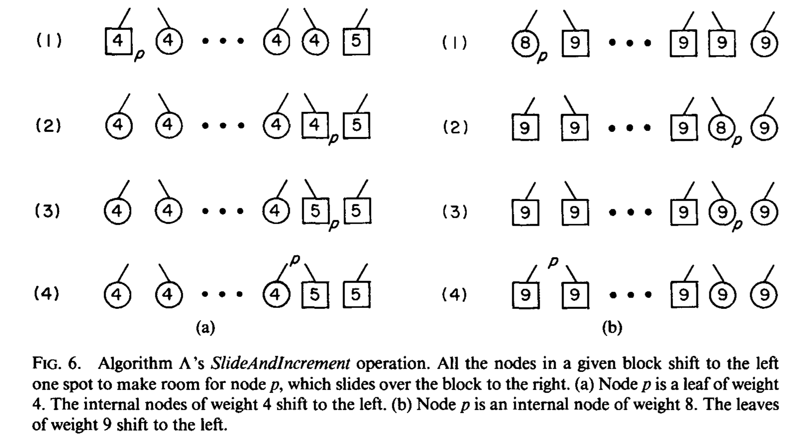
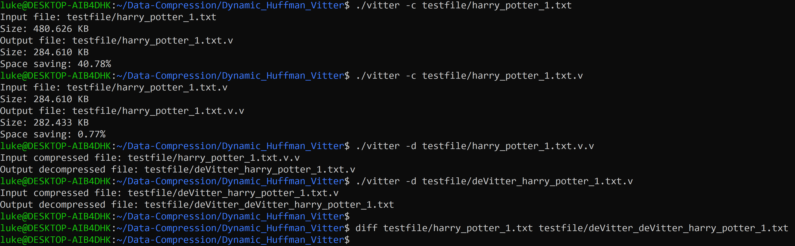

# Dynamic Huffman Vitter Algorithm Implementation

## Introduction

Dynamic Huffman encoding, compared to the static Huffman encoding, is a one-pass algorithm which reads the input file once only. The static Huffman reads twice, first time to generate the occurrence table and construct the binary tree, the second time to encode the file. In contrast, dynamic huffman encoding updates the tree at the same time as reading the file. The algorithm is thus a bit more complex than the statuc Huffman. 

Vitter invented the algorithm that is based on FGK algorithm. The main idea is that 
> For each weight w, all leaves of weight w precede (in the implicit numbering) all internal nodes of weight w. [Vitter 1987]

And he also provides a detailed implementation that uses array structure with a right pointer [Vitter 1989] which is a bit more complex and time efficient than his proposed functions in his earlier paper. 

## Details of the Update Function

The key to maintain the dynamic tree similar to the Huffman tree is in the update procedure. FGK algorithm produces a Huffman tree that may be skewed, and Vitter improves the procedure by generating a more balanced Huffman tree. 

```
Update_TreeVITTER( accept symbol )
{
    leafToIncrement = NULL;
    p = pointer to symbol’s node;

    if ( p == NULL ){/* a new symbol! */
        Create two leaf children of
         the 0-node,such that the
         right child is the new
         symbol node and the left child
         is the new 0-node;
        p = parent of the symbol node;
        leafToIncrement = the right child
         of p;
    }
    else {
        Swap p in the tree with the leader
            of its block;
        if ( p is the sibling of the
            0-node ) {
         leafToIncrement = p;
         p = parent of p;
        }
    }

    increase p weight by 1;
   
    while ( p != root of the tree ) {
        /* if possible, advance p to
            the next block. */
        SlideAndIncrement( p );
    }
   
    if ( leafToIncrement != NULL ) {
        SlideAndIncrement(leafToIncrement);
    }
}
```

We can see that, `SlideAndIncrement` is the major feature of Vitter's method. FGK only "swaps" the symbol node with the highest node of the block, while Vitter slides the whole block into targeted position. The following picture from Vitter's paper explains the procedure. 



To update a leaf node, slides all leaf nodes with same weight before it one position backwards, and make this leaf node the leader, and increase its weight. Then procede with its new parent node. 

To update an internal node, slides all leaf nodes with weight 1 higher before its position one position backwards, and move this internal node into the gap, increase its weight. Thenprocede with its original parent node. 

The pseudo code for `SlideAndIncrement` is at below. 
```
SlideAndIncrement ( accept node p ){
    fp = parent of p;
    wt = p’s weight;

    if ( p is an internal node )
        Slide p in the tree higher than the leaf nodes of weight wt+1;
    else 
        Slide p in the tree higher than the nodes of weight wt;

    p’s weight = p’s weight + 1;

    if ( p is an internal node ) 
        p = fp;
    else 
        p = new parent of p;
}
```

## Implementation for the Update Function

So the issue is, how to construct a data structure that not only can have the properties of a binary tree, but also can depict the increasing order of occurrence in the way like an array. My solution is to use the combination of a tree and a list. 

The tree structure is almost the same as all binary trees
```
struct _TreeNode{
    int c;
    int occ;
    struct _TreeNode *left;
    struct _TreeNode *right;
    struct _TreeNode *parent;
};

typedef struct _TreeNode *TreeNode;

struct _Tree{
    TreeNode root;
    TreeNode NYT;
};

typedef struct _Tree *Tree;
```

And the list has each node that encapsulates a treenode. So that each listnode relates to a particular treenode, and this relation never break. A doubly linked list is used to make implementation easier. 
```
struct _ListNode{
    TreeNode trn;
    struct _ListNode *prev;
    struct _ListNode *next;
};

typedef struct _ListNode *ListNode;
typedef struct _ListNode *List;
```

So during the `Update` procedure, especially the `SlideAndIncrement` step, the update not only happens on the tree level, but also on the list level. For each sliding, the block of treenodes first reconnects to its new parent, then the block of corresponding listnodes move and reconnect to its new position. For details please read `Update.h` and `Update.c` files. 

## Pesudo EOF Design

For compression, since the output for each symbol is not exactly 8 bits, there is always a problem for the EOF sign. Usually the last char has to be padded with several bits of 0 before printing. In this implementation, I uses a simple way. The first byte of the file records the number of bits of 0 padded at the last char of the file. 

So during compression, the actual output starts at the second byte. And when the compression finish, the padding function returns the number of bits padded, then the compression function goes back to the first byte of the file and reprint that char. 

And for decompression, the function reads the number of bits pad from the first char at first. Then it starts decompression from the second char. And when the file reads to the final char, it stops before the number of padded bits. 

## File Structure

```
main.c 
--- compress.c decompress.c
    --- update.c
        --- dictionary.c file.c
            --- list.c
                --- tree.c
```

## Usage

Codes for download the repository:

```
git@github.com:luke-mao/Data-Compression.git
cd Dynamic_Huffman_Vitter
make
```

```
Usage: ./vitter <-c|-d> <input file>   // -c for compression, -d for decompression
```

The compressed file will have .v suffix. 
The decompressed file will remove .v suffix, and add deVitter_ prefix. 

Sample usage shows in the picture.


## Reference

>Vitter, J., 1987. Design and analysis of dynamic Huffman codes. Journal of the ACM, 34(4), pp.825-845.

>Sites.google.com. 2020. Algorithm Vitter - The Data Compression Guide. [online] Available at: <https://sites.google.com/site/datacompressionguide/vitter> [Accessed 8 October 2020].

>UNSW 2020T2 COMP9319 Web Data Compression and Search by Raymond Wong
