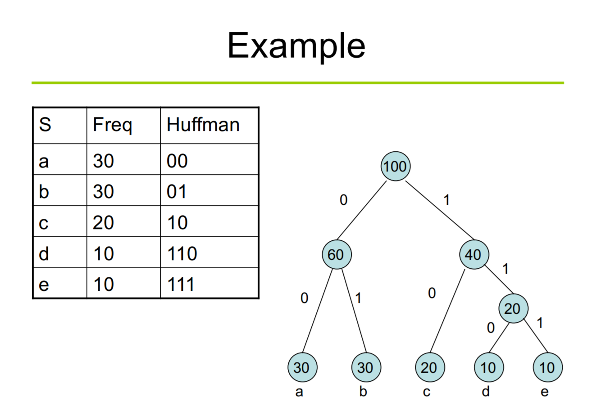
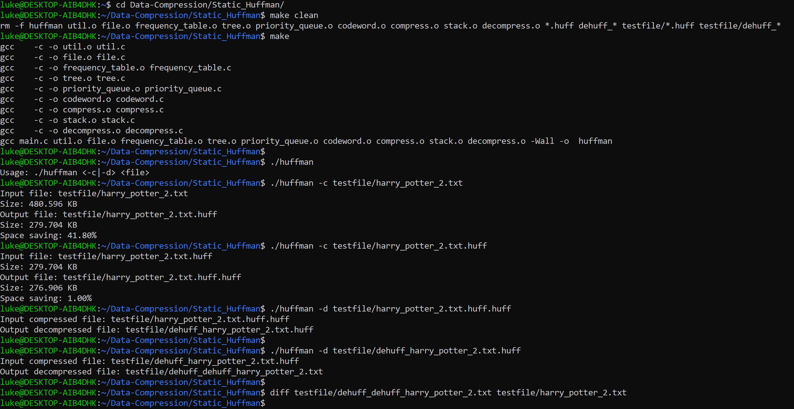
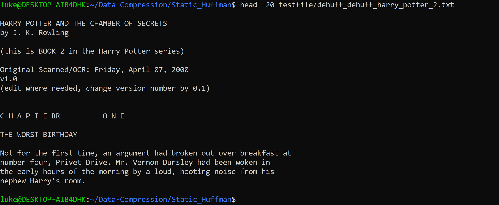

# Static Huffman Compression Implementation

## Introduction

David Huffman is best known for the invention of the static Huffman code which is a highly important compression scheme for lossless variable length encoding. It is a prefix-free code, meaning no two symbols share the same prefix codes. The implementation was written in his term paper when he was a graduate student in MIT. 

## Details of the Huffman Tree & Compression

The process to build a binary tree for compression is very simple and straightforward.

1. Read through the whole file and count the number of occurrence of each char.

2. For each char and its occ, wrap it using a treenode. And insert them into a queue which lists treenodes in an either increasing or decreasing trend of occ.

3. Take the two least probable symbols. Combine these two symbols into a single treenode. And re-insert back to the queue. 

4. Repeat step 3 until only one treenode left in the queue. And that node is the root of the tree. 

5. Assign each symbol with its path from root node to its node, with left being 0 and right being 1. 

6. Use these codewords to compress the file. 

The following image illustrates an example tree. Actual implementation may have small variations, such as node "a" and "b" may swap their positions in the tree. (Image credit to UNSW COMP9319 2020T2 Lecture PPT)


## Implementation

The compressed file will have **.huff** suffix.
The decompressed file will have **.huff** suffix removed, and add **dehuff_** prefix.

### Compression

**1. How to save the tree into the output file?**
    The naive way is simply print out the whole occurrence table into the file, line by line. But this violates the purpose of compression. Printing the whole table is useless, since what we focus is the position of each symbol in the tree, not the exact number of times it happen in that file. 
    So I choose to print the tree in to the file using a post order traversal. And later during decompression, a stack can simply reconstruct the tree from the file header part. During printing, when meets a leaf node, print bit 1 and follow the symbol in 8 bits. And when meet an internal node (or the root node), print bit 0 only. So in this way, during decompression, when the program meets a bit 1, it reads the next 8 bits and wrap the char with a treenode and push into the stack. When the program meets a bit 0, it pops two treenodes from the stack, create a new internal node and connect the two treenodes as left and right child, then push it back to the stack.


**2. How to insert pesudo EOF into the output file?**
    There are many methods to insert pesudo EOF. For example, you can choose a char that does not present in the input file as the pesudo EOF. However, in my implementation, as well as all my other compression implementation, I count the number of bytes padded at last, and print the number as the first char of the output file. So the decompression program first reads the number of bits padded from the first byte, then continue to work the decompression.

**3. File header**
    The compressed file structure is the below: 

1 byte | 1 byte | Tree | Body
------- | -------- | ------ | -----
| number of bits padded at the last char | number of distinct chars in the input file | Post-order traversal of the tree | Compressed file |

## Decompression

The decompression is much more easier than compression. During decompression, the program first reads the 2 bytes, then reconstruct the tree, and then decompress the file. The second byte is used to tell the program to stop, when the tree has insert that amount of leaf nodes, and when there is only one node left in the stack.

## File Structure

Three data structures, stack, priority queue and tree, are used. For the detailed dependency relationship, please refer to the makefile.

```
main.c
--- compress.c decompress.c
    --- codeword.c
        --- stack.c priority_queue.c
            --- frequency_table.c
                --- tree.c file.c
                    --- util.c
```

## Usage

```
git clone git@github.com:luke-mao/Data-Compression.git
cd Data-Compression/Static_Huffman
make
```

```
Usage: ./huffman <-c|-d> <file>  // -c for compression, -d for decompression
```

Example of use:





## Reference

>Huffman, D., 1952. A Method for the Construction of Minimum-Redundancy Codes. Proceedings of the IRE, 40(9), pp.1098-1101.

>www2.cs.duke.edu. 2020. Huffman Coding: A CS2 Assignment. [online] Available at: <https://www2.cs.duke.edu/csed/poop/huff/info/> [Accessed 10 October 2020]. (Provide the hint how to save the tree in to the file)

> UNSW 2020T2 COMP9319 Web Data Compression and Search by Raymond Wong